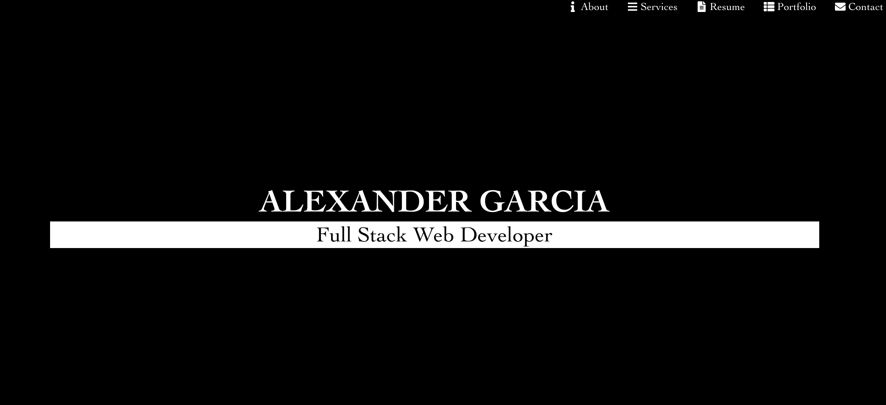

# Dynamic Portfolio
My motivation for recreating this portfolio is to demonstrate what I have learned from so far from this course.  
My portfolio shows I am able to a dynamic portfolio and ensure that it is reponsive. I want to be able to show future employers that I will work hard to try to achieve the task on hand.
In the future I hope to improve on this portfolio to make it more polished than the last. The GOAL is to always be better than before and never quit.
# Usage
This portfolio will be used to showcase my skills to future employers. Also it is a way that I am able to connect with others.
# Credits
Special credit goes to the team of instructors. Without their help; this portfolio wouldn't have been possible. Also with the help of Stackoverflow. Great community waiting to help.

## Submission on BCS

* https://alexpr704.github.io/Portfolio2/ Link to deployment.
* https://github.com/AlexPR704/dynamic Check out the code.

# License
MIT License

Copyright (c) [2020] [Alexander Garcia]

Permission is hereby granted, free of charge, to any person obtaining a copy
of this software and associated documentation files (the "Software"), to deal
in the Software without restriction, including without limitation the rights
to use, copy, modify, merge, publish, distribute, sublicense, and/or sell
copies of the Software, and to permit persons to whom the Software is
furnished to do so, subject to the following conditions:

The above copyright notice and this permission notice shall be included in all
copies or substantial portions of the Software.

THE SOFTWARE IS PROVIDED "AS IS", WITHOUT WARRANTY OF ANY KIND, EXPRESS OR
IMPLIED, INCLUDING BUT NOT LIMITED TO THE WARRANTIES OF MERCHANTABILITY,
FITNESS FOR A PARTICULAR PURPOSE AND NONINFRINGEMENT. IN NO EVENT SHALL THE
AUTHORS OR COPYRIGHT HOLDERS BE LIABLE FOR ANY CLAIM, DAMAGES OR OTHER
LIABILITY, WHETHER IN AN ACTION OF CONTRACT, TORT OR OTHERWISE, ARISING FROM,
OUT OF OR IN CONNECTION WITH THE SOFTWARE OR THE USE OR OTHER DEALINGS IN THE
SOFTWARE.
